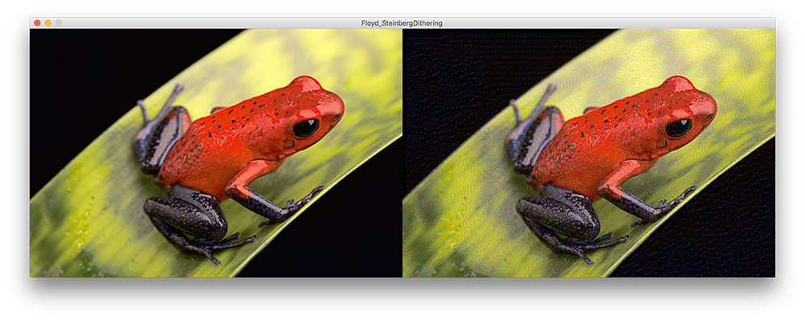

# Floyd-Steinberg Dithering #

A dithering technique using error diffusion, meaning it pushes (adds) the residual quantisation error of a pixel onto its neighbouring pixels, to be dealt with later.

Based on Daniel Shiffman's Coding Train video:
https://www.youtube.com/watch?v=0L2n8Tg2FwI

 

  

