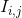

# Image Thresholding #

Thresholding is the simplest method of image segmentation.

This is the simplest thresholding method and operates by replacing each pixel in an image with a black pixel if the image intensity 
  is less than some fixed constant  (i.e. 
), or a white pixel if the image intensity is greater than that constant. In the example image, this results in the dark areas becoming completely black, and the lighter snow becoming completely white.

Algorithm adapted from: https://en.wikipedia.org/wiki/Thresholding_(image_processing)

 

  

