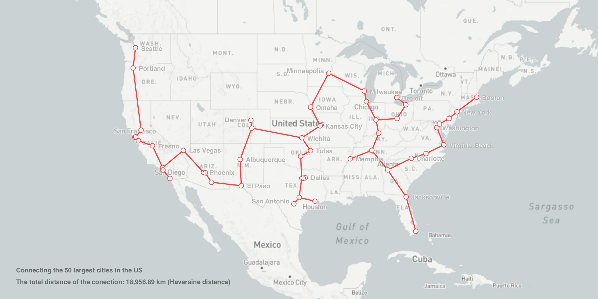

Minimum Spanning Tree (Cities)
==============================

This project uses Prim's Algorithm to calculate the Minimum Spanning Tree required to connect the 50 largest cities in the US.

Resources: 
* Based on Daniel Shiffman's Minimum Spanning Tree solution from the Coding Train coding challenges series:
https://www.youtube.com/watch?v=BxabnKrOjT0
* Also based on Daniel Shiffman's Web Mercator projection example:
https://www.youtube.com/watch?v=ZiYdOwOrGyc&t=1705s
* Haversine distance formula: 
http://stackoverflow.com/questions/27928/calculate-distance-between-two-latitude-longitude-points-haversine-formula

  

