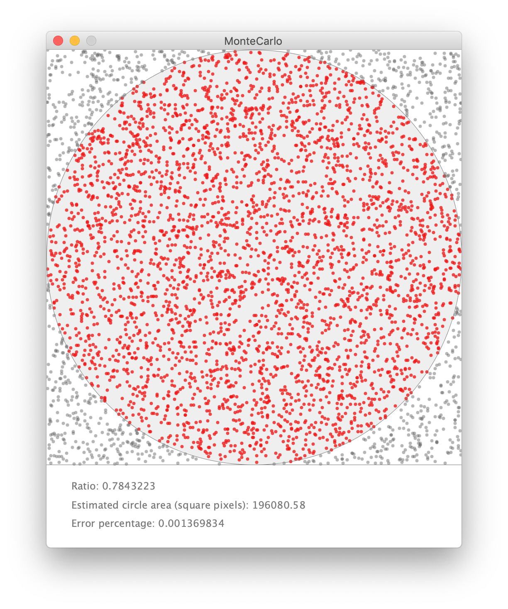
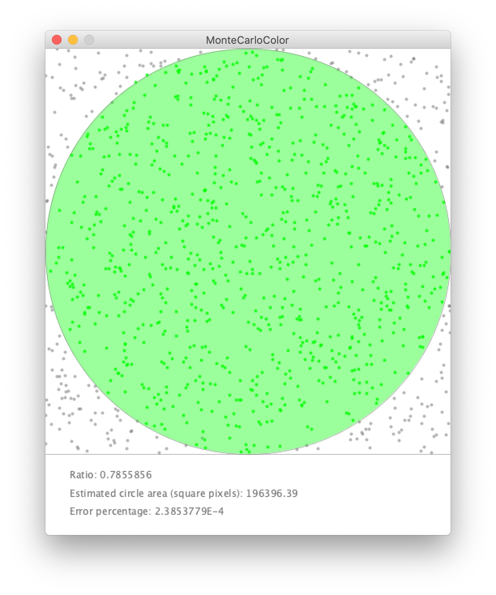
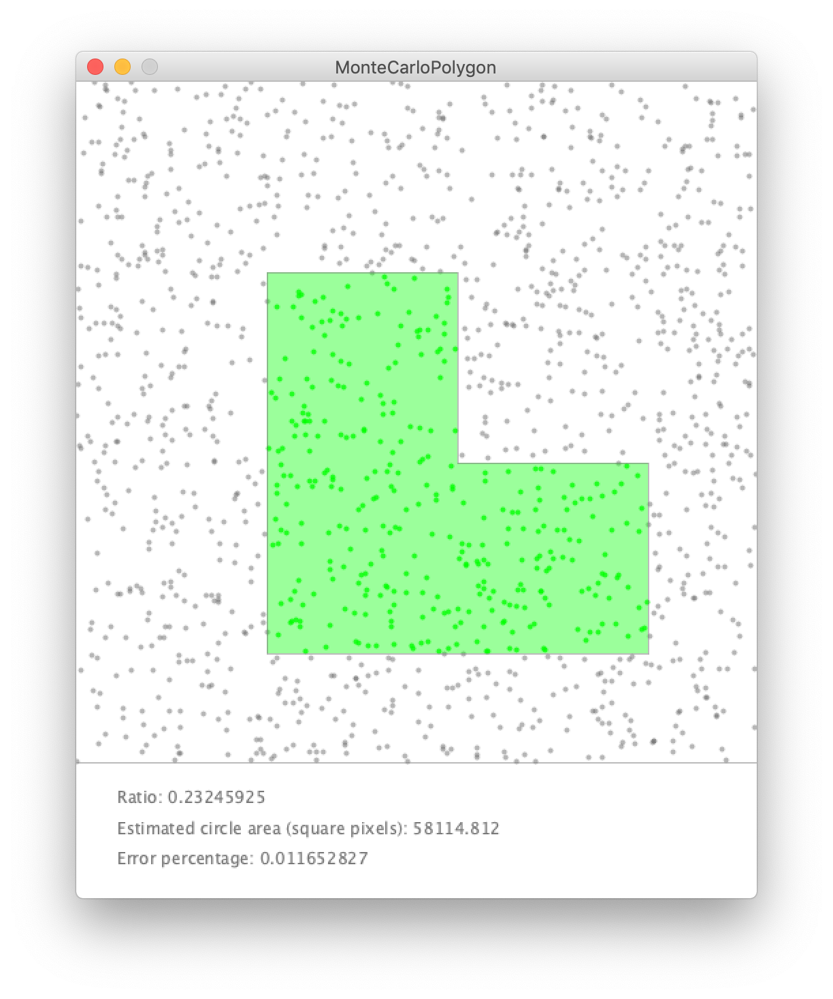
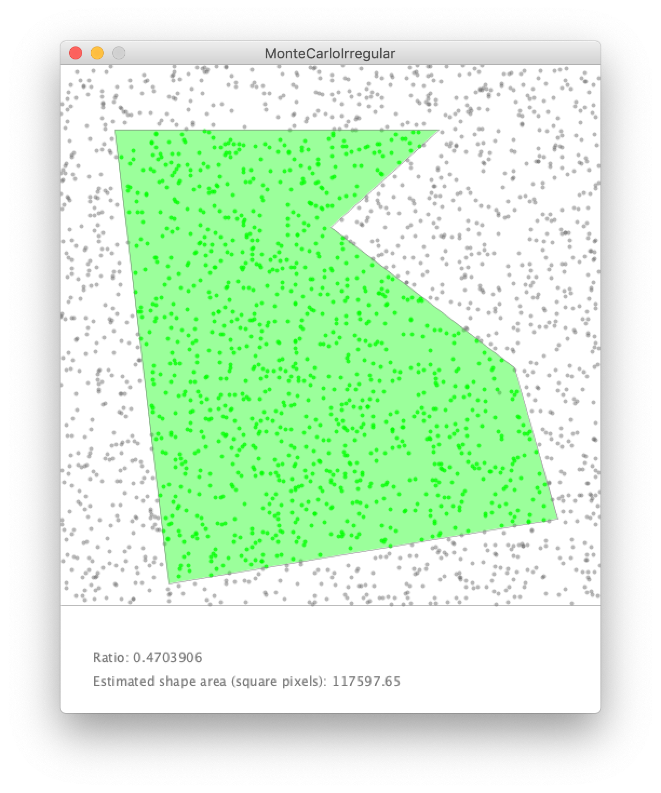

# Monte Carlo Integration

Simple Monte Carlo Integration simulations to calculate the area of a give shape, using random numbers.

### [Monte Carlo Distance:](https://github.com/Carla-de-Beer/Processing/tree/master/MonteCarloIntegration/MonteCarloDistance) Distance metric (circle)

 

  
  
  
  

### [Monte Carlo Color:](https://github.com/Carla-de-Beer/Processing/tree/master/MonteCarloIntegration/MonteCarloColor) Colour metric (circle)
 

  

### [Monte Carlo Polygon:](https://github.com/Carla-de-Beer/Processing/tree/master/MonteCarloIntegration/MonteCarloPolygon) Colour metric (regular polygon)
 

  

### [Monte Carlo Irregular:](https://github.com/Carla-de-Beer/Processing/tree/master/MonteCarloIntegration/MonteCarloIrregular) Colour metric (irregular polygon)
 

  

