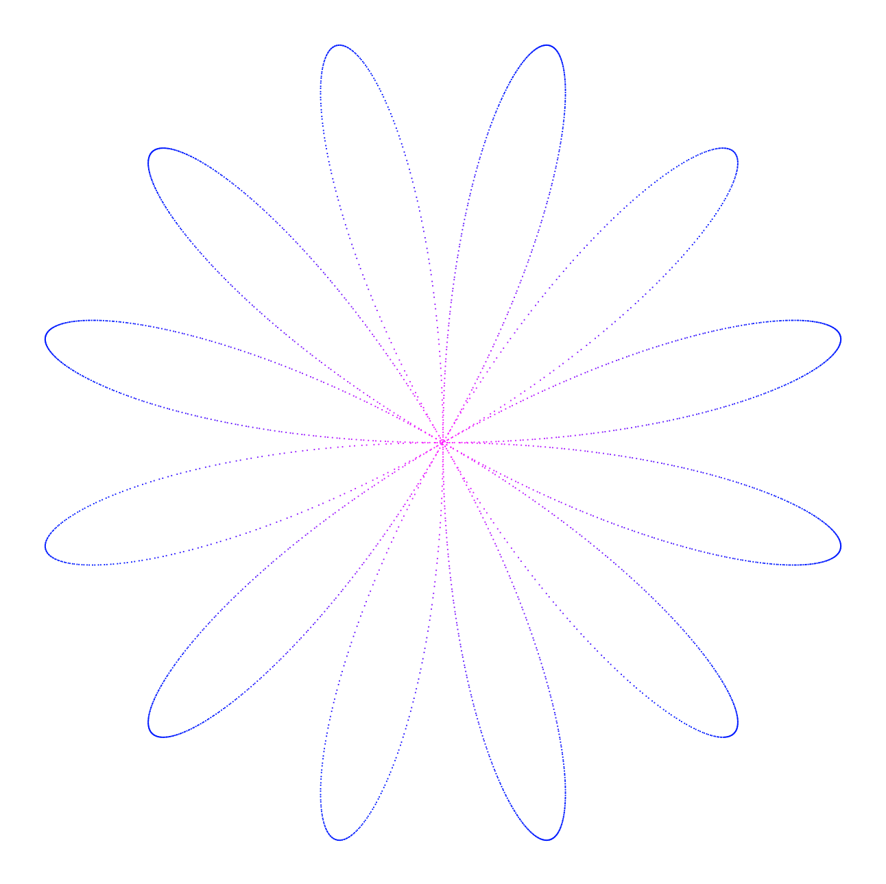
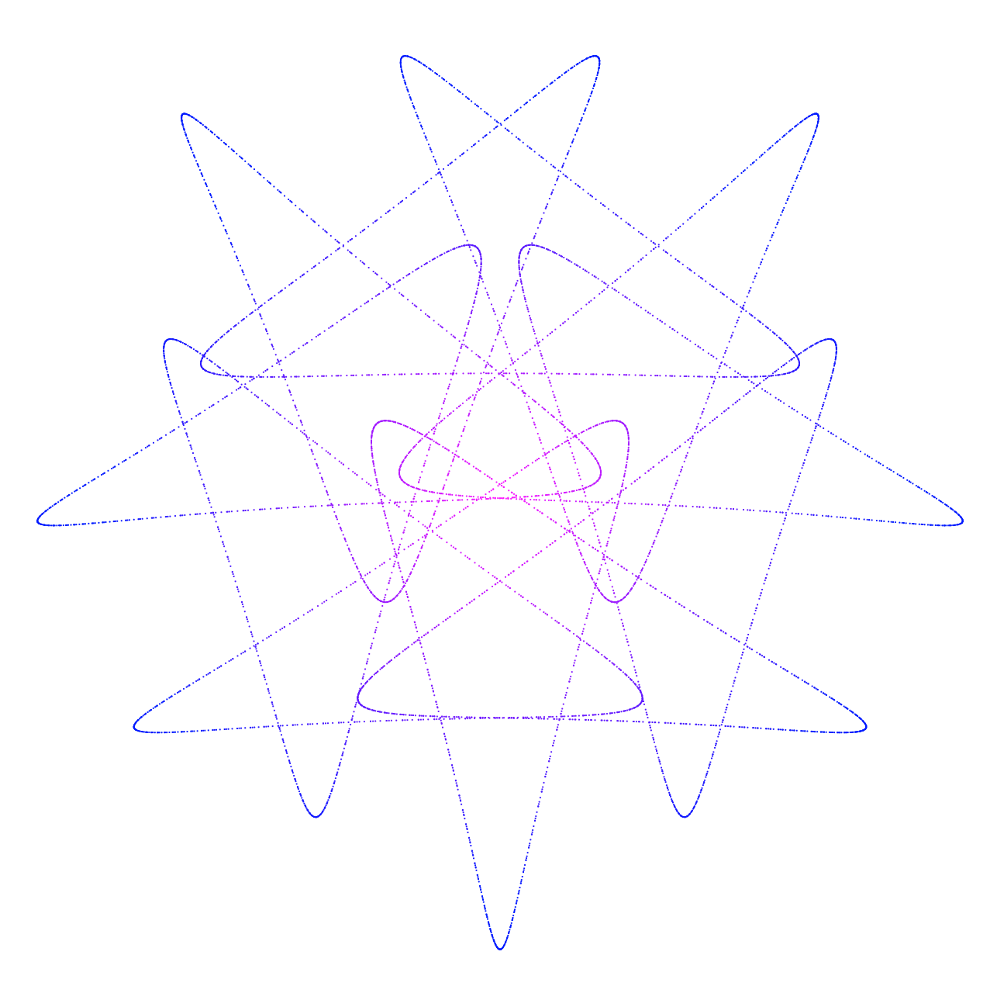
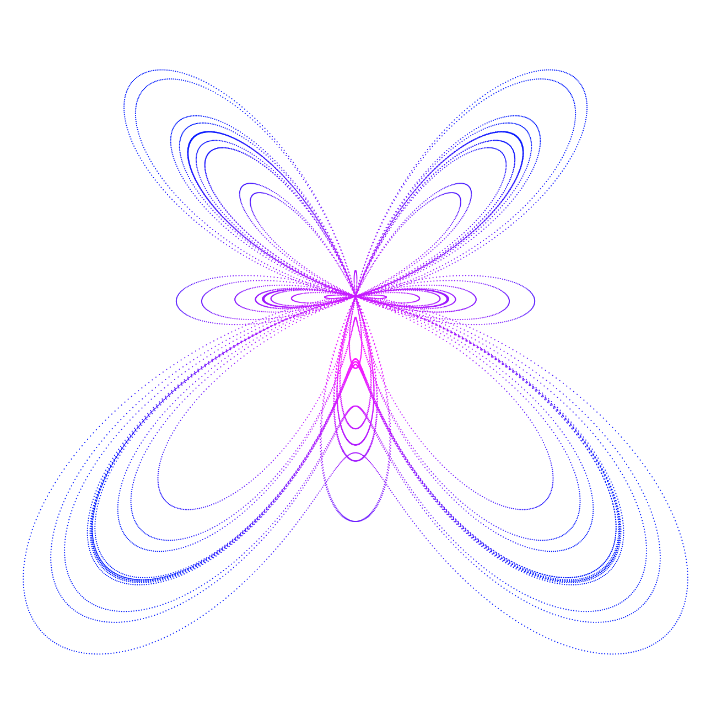
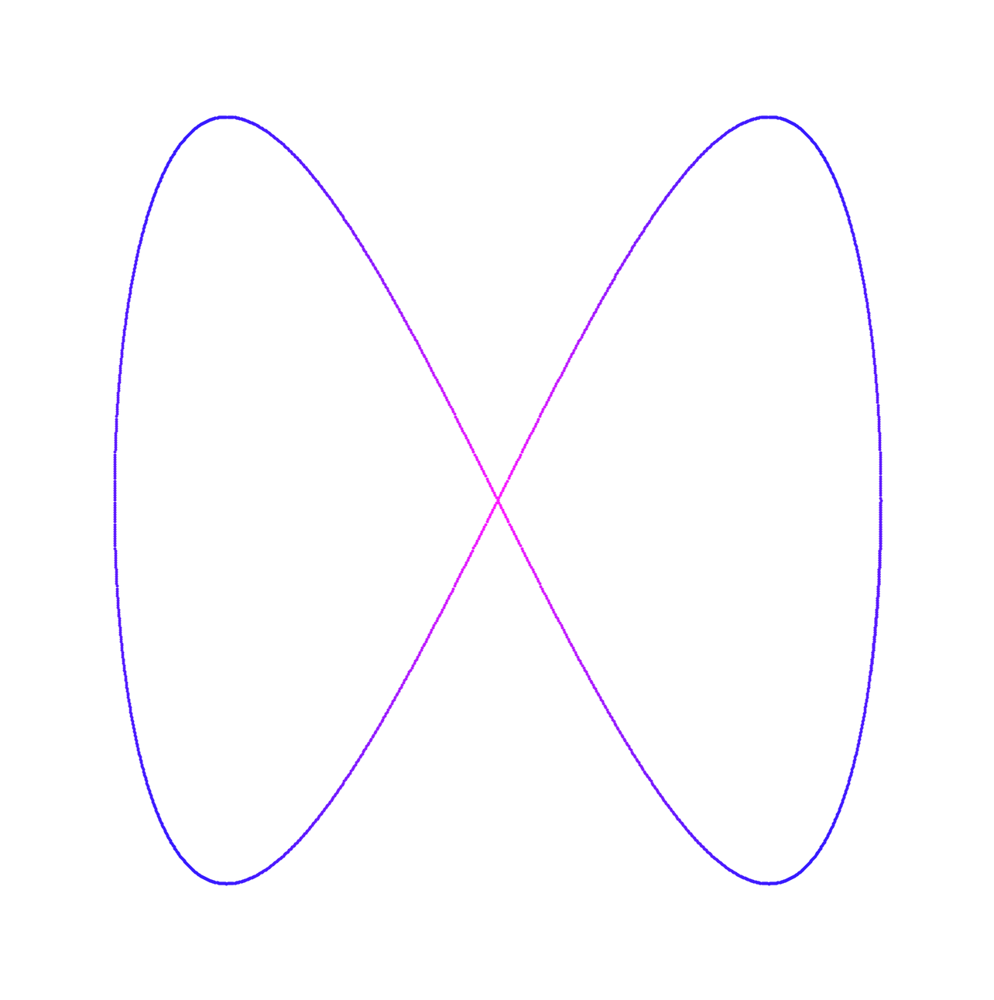
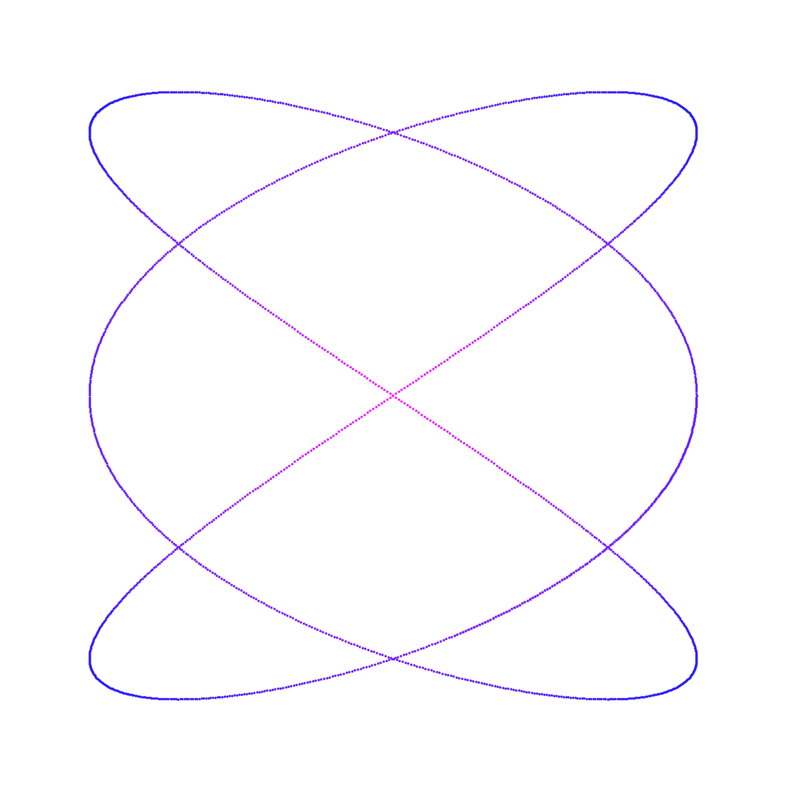
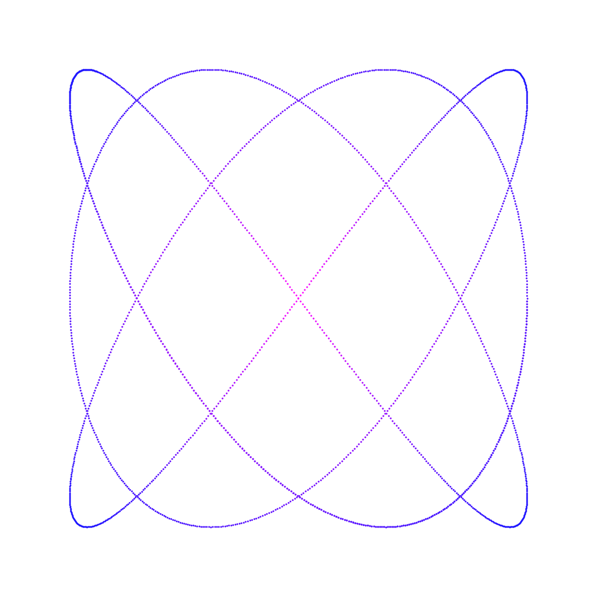
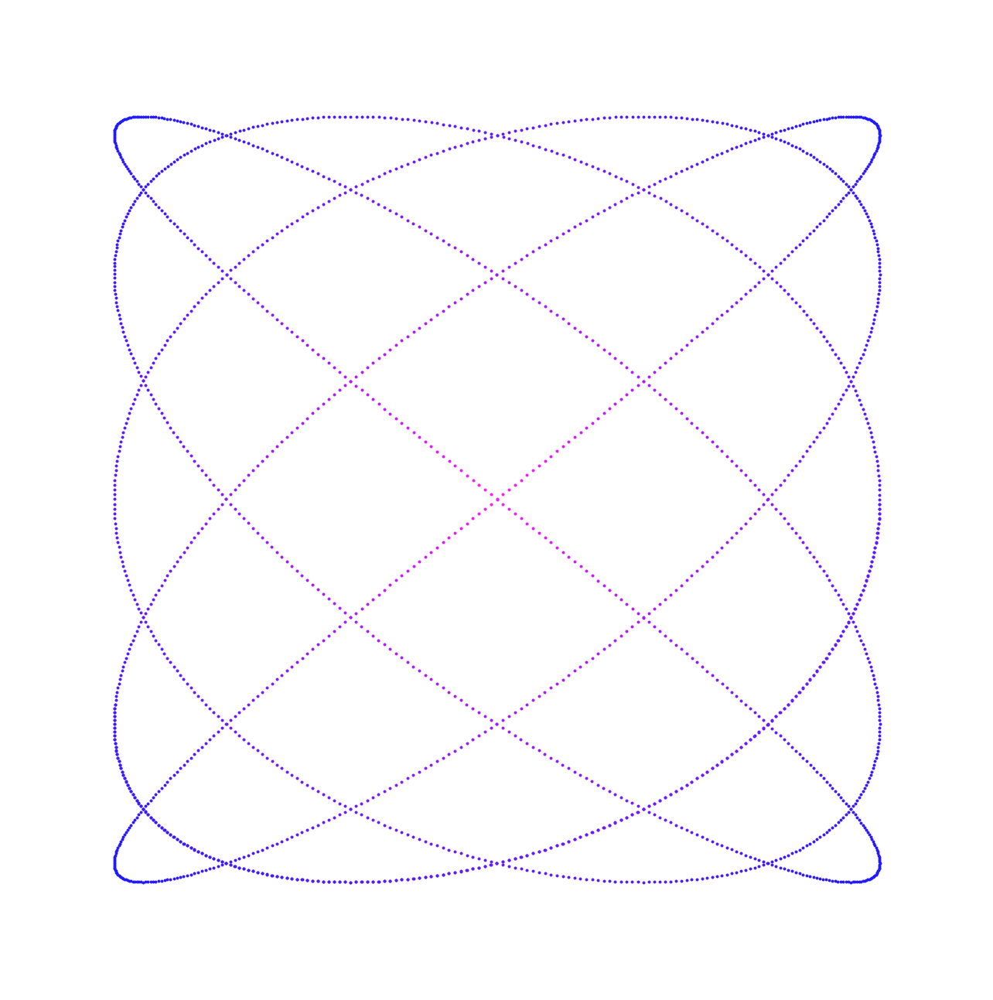

# Parametric Curves

Parametric equations are a set of equations that express a set of quantities as explicit functions of a number of independent variables, known as "parameters."

For example, one set of parametric equations for a unit circle are given by
* 
* 

where  is the parameter: A point (x, y) is on the unit circle if and only if there is a value of   such that these two equations generate that point.

Parametric representations are generally non-unique so the same quantities may be expressed by a number of different parameterisations.

 

  
  
  

## Lissajous Curves

A Lissajous curve, also known as Lissajous figure or Bowditch curve, is the graph of a system of parametric equations

* 
* 

Lissajous figures therefore constitute a subset of parametric equations.

 

  
  
  
  
  

This folder contains the following parametric sketches:
* [Parametric and Lissajous Curves:](https://github.com/Carla-de-Beer/Processing/tree/master/ParametricCurves/ParametricCurves) The sketch is run from the command line with pre-defined parametric equations provided
* [Parametric Heart Curves:](https://github.com/Carla-de-Beer/Processing/tree/master/ParametricCurves/ParametricHeartCurves) A cardioid curve circumscribing a heart curve
* [Parametric Grid:](https://github.com/Carla-de-Beer/Processing/tree/master/ParametricCurves/ParametricCurveGrid) A grid with a set of 4 x 4 parametric curves
