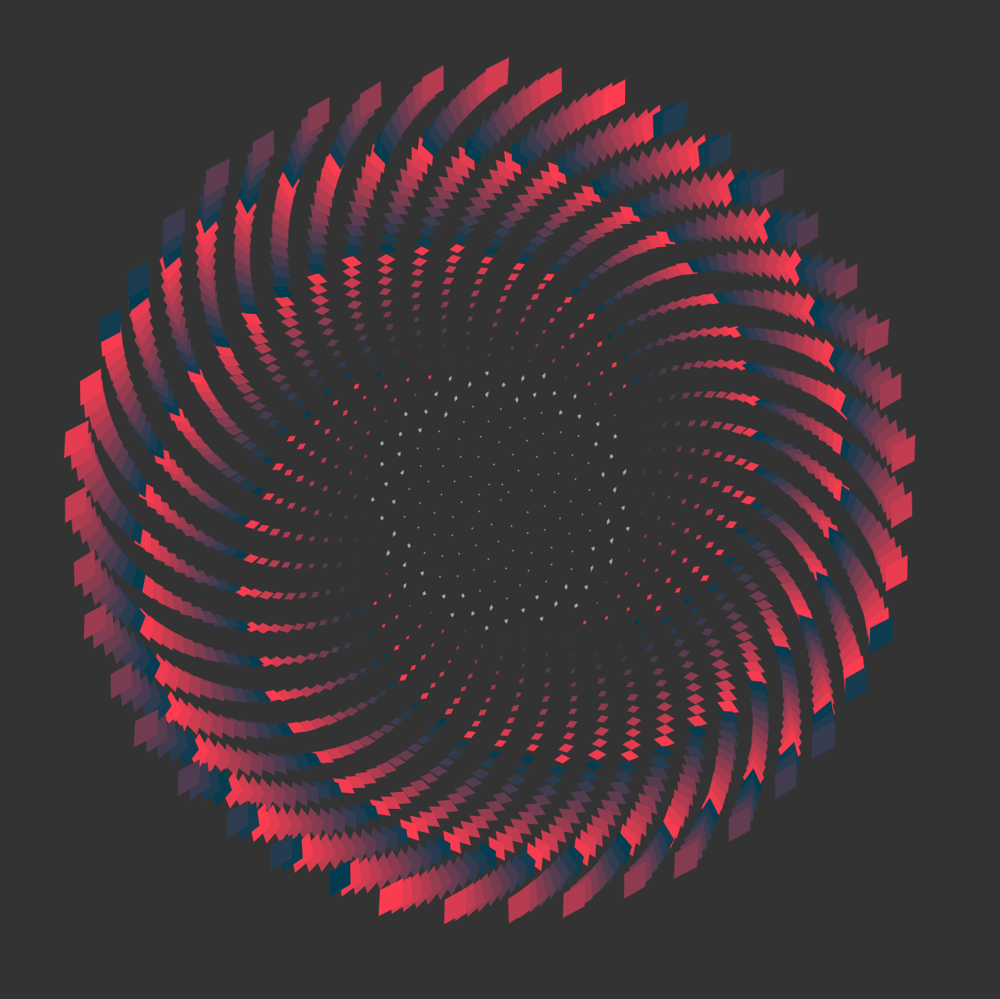

Phyllotaxis
===========

Sunflower-like construction based on phyllotaxis design principles.

Based on Daniel Shiffman's Coding Train coding challenge:
https://www.youtube.com/watch?v=MQMJ0xWSMWE

 

  

