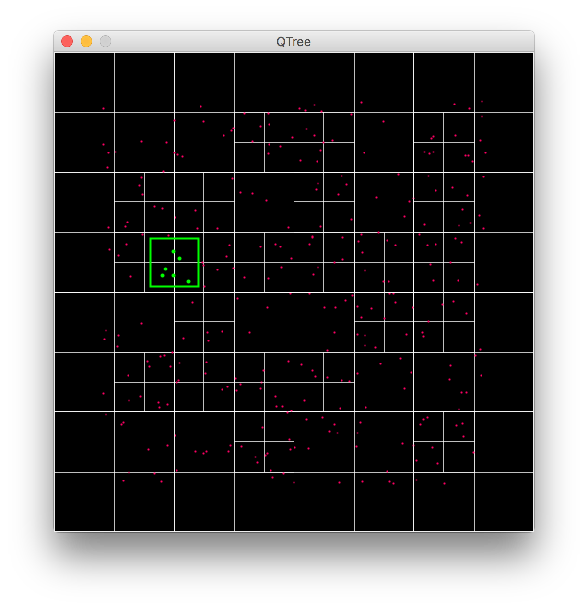

# Quad Tree

Processing version of a basic Quad Tree implementation that reduces the number of particle checks required.

Based on Daniel Shiffman's Coding Train videos:
* https://www.youtube.com/watch?v=OJxEcs0w_kE
* https://www.youtube.com/watch?v=QQx_NmCIuCY

  

