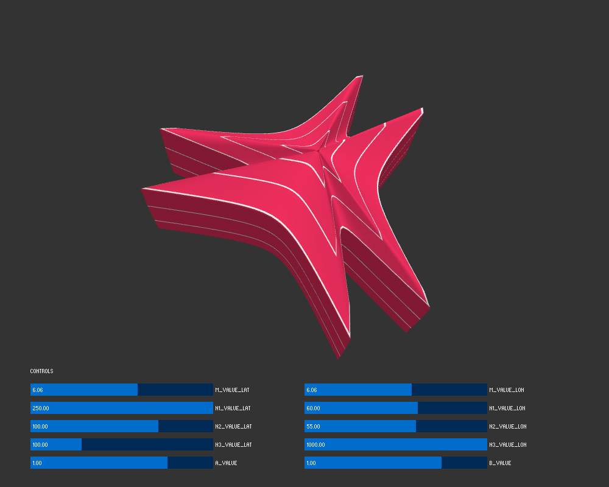

# Super Shapes #

Parametrically controllable 3D SuperShape generator.

Based on Daniel Shiffman's Coding Train coding challenge:
Refer also to http://paulbourke.net/geometry/supershape/ for parametric settings suggestions.

 

  
  
  

