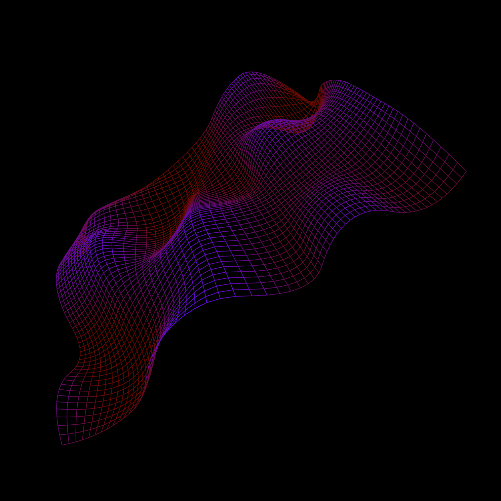

Animated NURBS surface
======================

An animated NURBS surface imbued with movement through the addition of a particle spring system. 

NURBS algorithm based on that of Alasdair Turner's: http://www.openprocessing.org/sketch/8101

  

