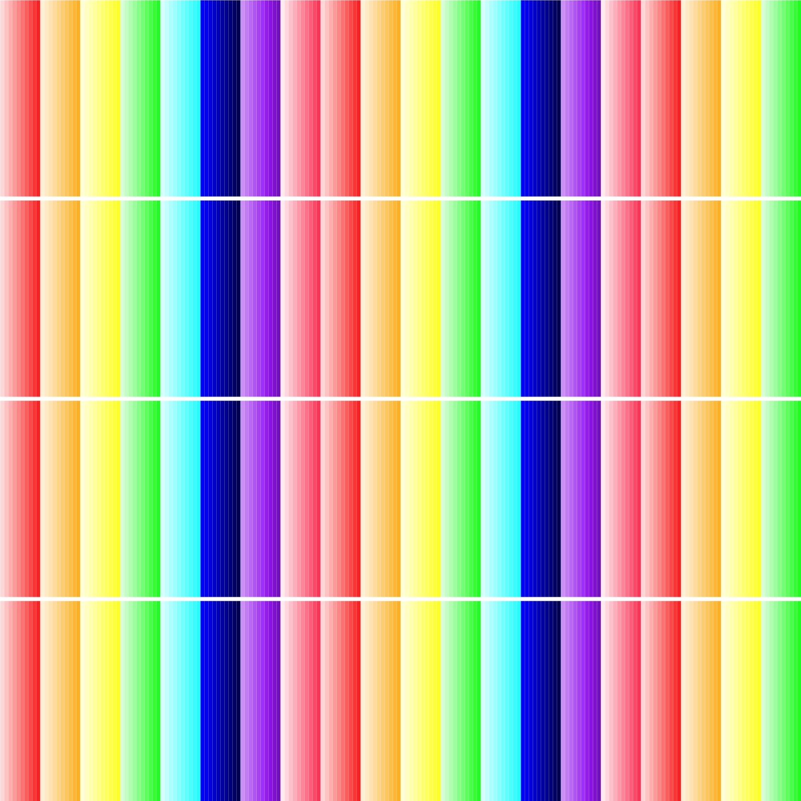
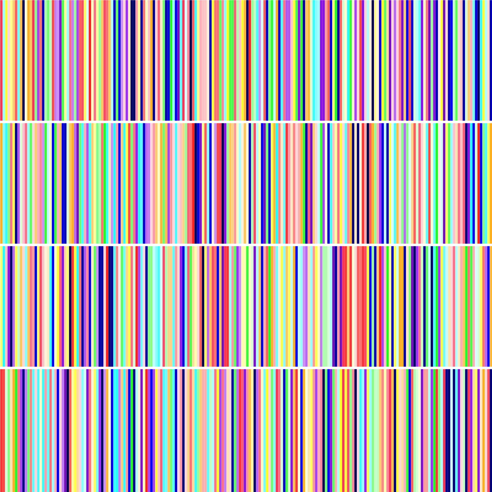
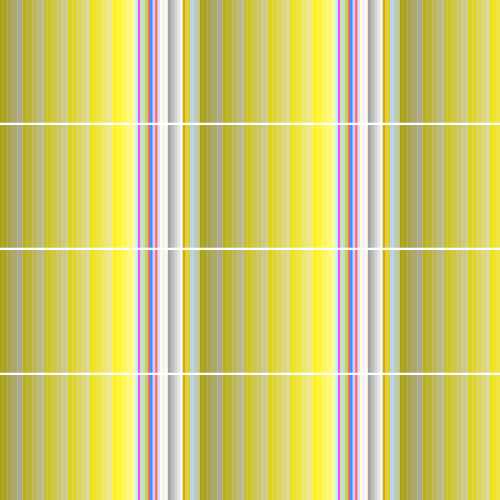
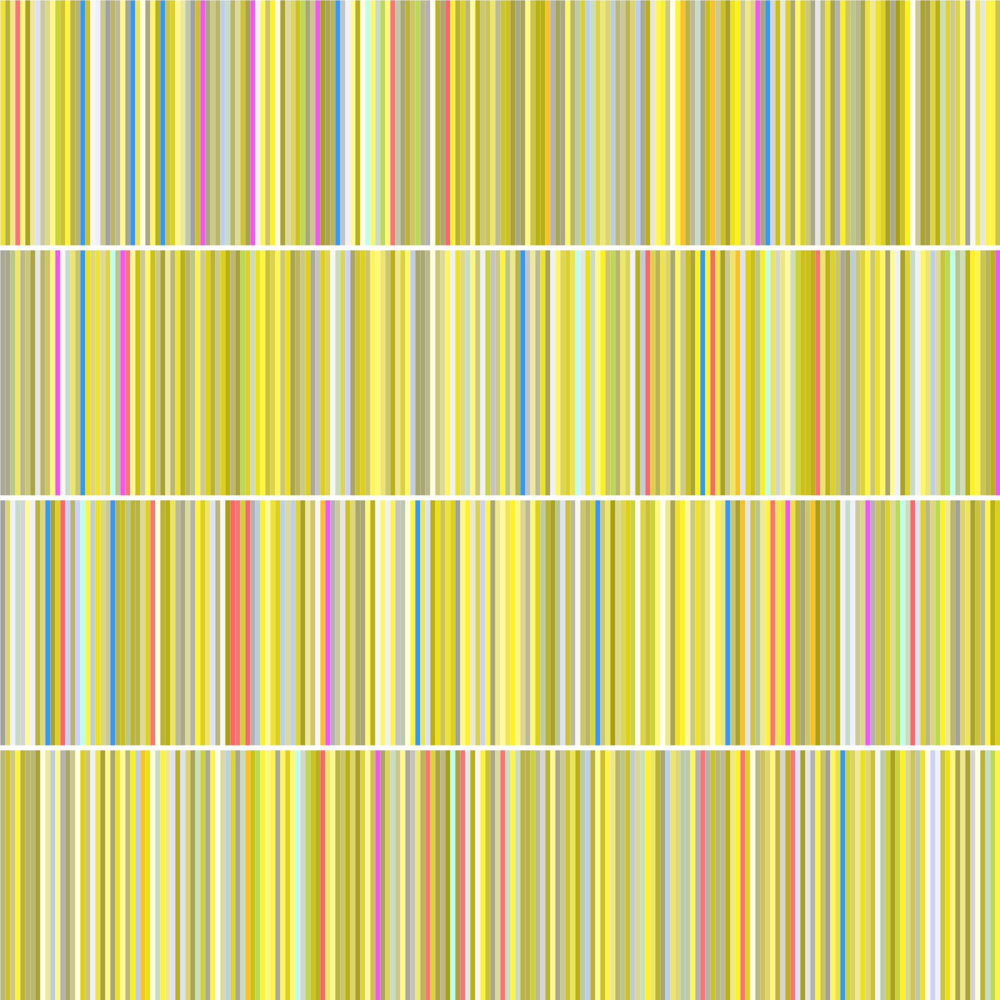

# 80 colours spread over 800 lines

80 colours spread over 800 lines (part of Genuary 2022: 80x800). The colours can be applied either randomly, or sequentially, in which case each of the 80 colours can be applied 10 times over the 800 lines. Two colour palettes were used: a rainbow palette, as control sample, and a custom one with 80 unique colours, most of which are based on shades of yellow. The rainbow palette has 8 colours with 10 shades each.

  

  

  

  

