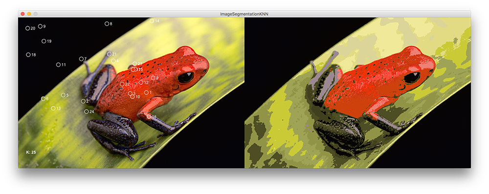
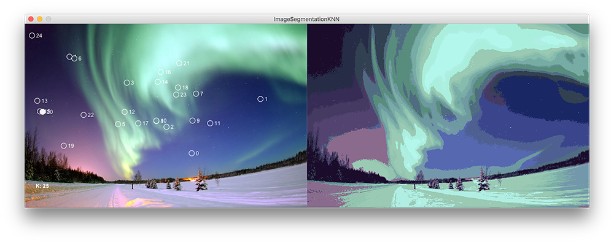

# Image Segmentation (K-Nearest Neighbour) #

An image segmentation example using the k-nearest neighbour algorithm.

Press `'R'` or `'r'` to restart the sketch. A single mouse press halts the centroid recalculation.

Algorithm adapted from: https://en.wikipedia.org/wiki/Image_segmentation.

## Compression rates

* Frog image:
  * The original image: 1,140,027 bytes.
  * The segmented image: 704,740 bytes (this will vary depending on each segmentation initialisation).
  * Compression rate: 38.182165861%.

* Polar image:
  * The original image: 940,641 bytes.
  * The segmented image: 606,035 bytes (this will vary depending on each segmentation initialisation).
  * Compression rate: 35.572125817%.

 

  
  

