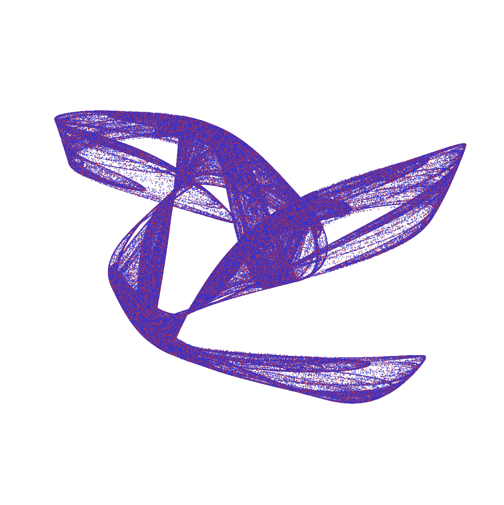
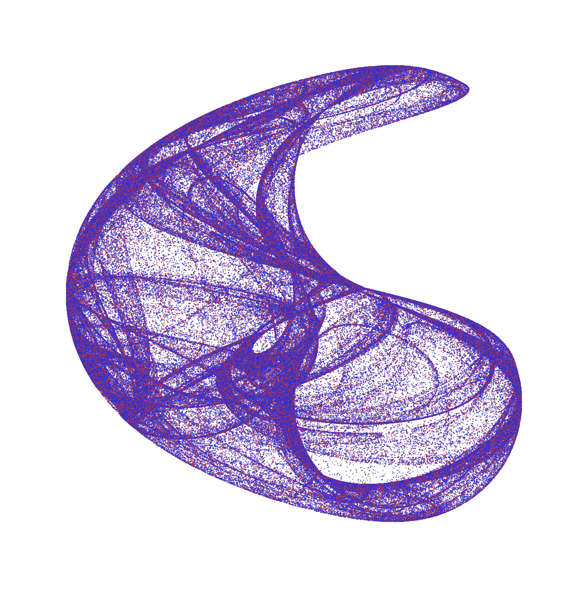

# De Jong Attractor

This sketch contains a set of 5 pre-defined De Jong Attractor variable sets. Uncomment any of the variable sets inside setup and run.

Inspiration taken from:

http://www.algosome.com/articles/strange-attractors-de-jong.html

http://paulbourke.net/fractals/peterdejong/

## Equations used
  * 
  * 

## Curves generated

  
  
  
  
  

